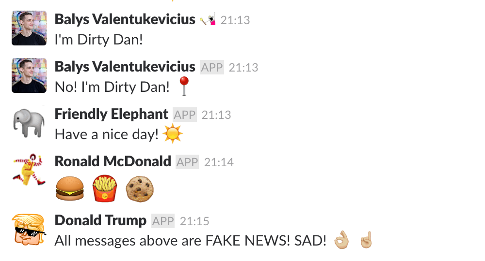

# Back-SLot

Liven up your slack channels by pretending to be the elephant emoji, Ronald McDonald or your coworker!



## Prerequisites

- Acquire a Slack Api Token:
    - Go to your company's [Slack apps](https://api.slack.com/apps) and create a new application
    - Perform an [OAuth request](https://api.slack.com/tutorials/app-creation-and-oauth) using the client id & secret to get an api token
    - Store the api token in `config.py`, do not share it!
- Install `python` and `pip` (any version)
- Run `pip install -r ./requirements.txt`
- Contemplate that this is to be used for harmless fun and not "impersonating" your CEO in #general and promising a company wide salary raise. Unless you are the CEO, then whatever ¯\\_(ツ)_/¯
- Yes, I deliberately made this setup more awkward than it should be because of the point above

## Usage

Don't worry about your private Slack data, the script is stateless!

```
// Post using an emoji (including custom ones) as an avatar and an arbitrary name
python slack_post.py -c <channel> -m <message> -e <emoji> -n <name>

// Post with any image as an avatar and any name
python slack_post.py -c <channel> -m <message> -i <imageUrl> -n <name>

// Post as a public user from your company's Slack
python slack_post.py -c <channel> -m <message> -u <username>
```

## License

MIT
